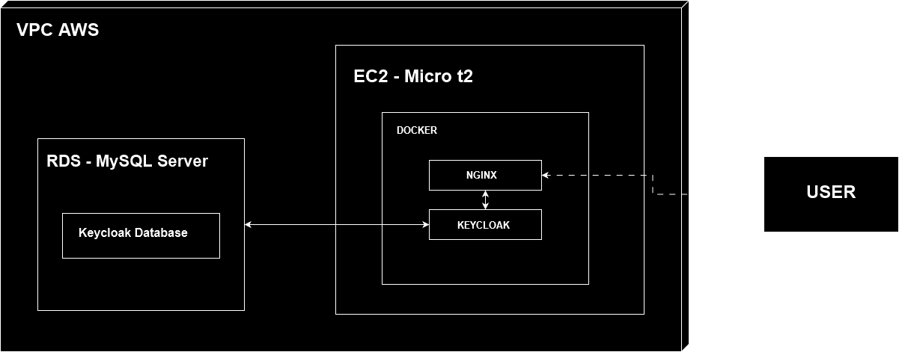

# KeycloakAWS

[**Português**](README.md) | [**English**](README.en.md)

This project aims to implement an EC2 server on AWS with a web server and an authentication service using Keycloak running in Docker.

***PROJECT STATUS***: In development...

## Table of Contents

- [Introduction](#introduction)
- [Project Diagram](#project-diagram)
- [Prerequisites](#prerequisites)
- [Installation and Configuration](#installation-and-configuration)
  - [Instance Creation](#instance-creation)
  - [DNS Configuration](#dns-configuration)
  - [Generating SSL Certificate](#generating-ssl-certificate)
  - [Database Setup](#database-setup)
  - [Configuring Secrets](#configuring-secrets)
  - [Modifying Site Configurations](#modifying-site-configurations)
  - [Running the Workflow](#running-the-workflow)
- [Usage](#usage)
- [Contributing](#contributing)
- [License](#license)

## Introduction

KeycloakAWS is a project designed to deploy an EC2 instance on AWS with a web server and authentication service using Keycloak, all running in Docker. This setup provides a robust and scalable authentication solution for your applications.

## Project Diagram



## Prerequisites

- AWS Account
- Domain Name
- Basic knowledge of SSH and Docker

## Installation and Configuration

### Instance Creation

Create your AWS instance for a Linux Ubuntu or Amazon Linux server and open HTTP-80, HTTPS-443, and SSH-22 ports. Now, using the SSH key configured in the instance, let's access our server.

```bash
ssh -i yourPrivateKey.pem yourUser@TheHostAddress
```
### DNS Configuration: 

After acquiring the public IP of your instance, you need to configure the DNS of your domain provider or DNS provider to point to the server.

### Generating SSL Certificate

First, you will need to install Certbot if you don't have it:
- ubuntu
    ```bash
    sudo snap install --classic certbot
    ```
- Amazon Linux
    ```bash
    sudo python3 -m venv /opt/certbot/
    sudo /opt/certbot/bin/pip install --upgrade pip
    sudo /opt/certbot/bin/pip install certbot
    sudo ln -s /opt/certbot/bin/certbot /usr/bin/certbot
    ```
Then, simply generate your free SSL certificate:

```bash
sudo certbot certonly --manual --preferred-challenges dns
```
Following the instructions, you will encounter two codes to configure in your DNS as a TXT record. After configuring, return to the prompt and continue. If everything is correct, your certificate will be successfully generated and will go to the folders in "etc/LetsEncrypt/yourdomain/live". Our pipeline is already configured to move the certificates to the correct folder.

    - Note: If the certificate is not generated this way, simply take the certificates generated by your SSL certificate provider and copy them to the etc/certificates folder. Make sure the certificate file names match the configuration in the sites-available folder.

### Database Setup 

After creating your database server on RDS, follow the steps below:

1. Note the access URL of the database server.
2. Keep the credentials used for access noted.
3. Open the terminal and access your EC2 instance via SSH.
4. Install the DBMS Client of your database, in my case, MySQL.
5. Access your database:
    - For MySQL:
        ```bash 
        mysql -u yourUserName -h DataBaseURL -p
        ```
    - Enter the password, and you will have access to the database server.
6. Inside the DBMS, create the database that will be used in Keycloak:
    ```bash
    CREATE DATABASE YourDataBase
    ```
### Configuring Secrets

 In your repository, configure the Secrets to use GitHub Actions:

- DB_HOST: Database host address;
- DB_NAME: Database name;
- REPOSITORY: Link to your repository. Note: If your repository is private, you will need to edit the workflow to access the private repository with your credentials or a created key;
- HOST: Address of your instance;
- USERNAME: Instance username;
- SSH_PRIVATE_KEY: SSH key for instance access via GitHub Actions;
- KEYCLOAK_USER: Keycloak admin user;
- KEYCLOAK_PASSWORD: Default Keycloak password;
- DB_PORT: Port used by the database;
- DB_USER: Database user;
- DB_PASSWORD: Database password;

### Modify Site Configurations

Inside the nginx/sites-available folder in the repository, there is an example site. Change the file name to the configured domain and edit the domain name inside it.

####  
#### 

### Running the Workflow

In GitHub Actions, after configuring all secrets, run the "Start_2.0.yml" workflow. After execution completes, try accessing your domain.

If you encounter issues, analyze the errors in the workflow, access your instance, and use Docker commands like docker ps, docker ps -a, docker logs NGINX, docker logs Keycloak to understand what happened.

### Usage
##### Building this section...

### Contributing

Contributions are welcome! Please fork the repository and use a feature branch. Pull requests are warmly welcome.

## License

This project is licensed under the MIT License.

## EXTRA

**Angular Application Build Pipeline**: Whenever the content of the Keycloak_front folder is updated in the "main" branch, an automatic deployment will be done.

**NGINX Update Pipeline**: Whenever the NGINX configurations are changed in the "main" branch, the system will update them within the container and restart it.

**Keycloak Theme Update Pipeline**: Whenever the content of the keycloak_themes folder is updated in the "main" branch, these themes will be automatically updated.