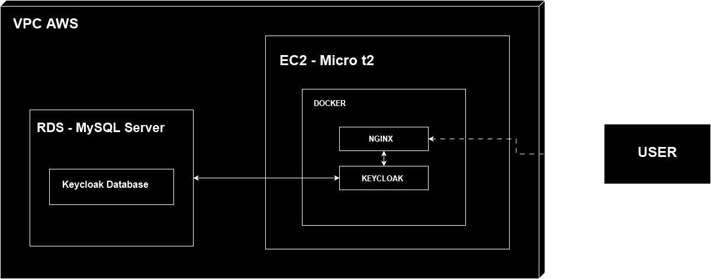

# KeycloakAWS

[**Português**](README.md) | [**English**](README.en.md)

Este projeto tem como objetivo a implementação de um servidor EC2 na AWS com um servidor web NGINX e um serviço de autenticação com Keycloak rodando em Docker.

***STATUS DO PROJETO***: Em desenvolvimento...

## Índice

- [Introdução](#introdução)
- [Diagrama do Projeto](#diagrama-do-projeto)
- [Pré-requisitos](#pré-requisitos)
- [Instalação e Configuração](#instalação-e-configuração)
  - [Criação da Instância](#criação-da-instância)
  - [Configuração de DNS](#configuração-de-dns)
  - [Gerando Certificado SSL](#gerando-certificado-ssl)
  - [Configuração do Banco de Dados](#configuração-do-banco-de-dados)
  - [Configurando Secrets](#configurando-secrets)
  - [Modificando Configurações do Site](#modificando-configurações-do-site)
  - [Executando o Workflow](#executando-o-workflow)
- [Uso](#uso)
- [Contribuindo](#contribuindo)
- [Licença](#licença)

## Introdução

KeycloakAWS é um projeto projetado para implantar uma instância EC2 na AWS com um servidor web e serviço de autenticação usando Keycloak, tudo rodando em Docker. Esta configuração fornece uma solução de autenticação robusta e escalável para suas aplicações.

## Diagrama do Projeto



## Pré-requisitos

- Conta na AWS (Free Tier ou não)
- Nome de domínio
- Conhecimentos básicos de SSH e Docker

## Instalação e Configuração

### Criação da Instância

Crie sua instância da AWS para um servidor Linux Ubuntu e abra as portas HTTP-80, HTTPS-443 e SSH-22. Agora, usando a chave SSH configurada na instância, vamos acessar nosso servidor.

```bash
ssh -i suaChavePrivada.pem seuUsuario@EnderecoDoHost
```

### Configuração de DNS

Após adquirir o IP público da sua instância, é necessário configurar o DNS do seu provedor de domínio ou de DNS para apontar para o servidor.

### Gerando Certificado SSL

Primeiro, você precisará instalar o Certbot se não tiver:

```bash
sudo snap install --classic certbot
```

Depois, basta gerar gratuitamente seu certificado SSL:

```bash
sudo certbot certonly --manual --preferred-challenges dns
```

Seguindo as instruções, você deve se deparar com dois códigos para configurar em seu DNS um registro TXT. Depois de configurado, volte ao prompt e continue. Se tudo estiver correto, seu certificado será gerado com sucesso e irá para as pastas em "etc/LetsEncrypt/seudominio/live". Nosso pipeline já está configurado para mover os certificados para a pasta correta.

    Obs: Caso não gere o certificado desta forma, basta pegar os certificados gerados pelo seu provedor de certificados SSL e copiar para a pasta etc/certificados. Certifique-se de que os nomes dos arquivos do certificado correspondem à configuração na pasta sites-available.
    Configuração do Banco de Dados

Após criar seu servidor de banco de dados no RDS, siga as etapas abaixo:

1. Anote a URL de acesso ao servidor do banco.
2. Tenha anotadas as credenciais utilizadas para acesso.
3. Abra o terminal e acesse sua instância EC2 via SSH.
4. Instale o cliente do SGBD do seu banco, no meu caso, MySQL.
5. Acesse seu banco de dados:
    - Para MySQL:

    ```bash
    mysql -u seuUsuario -h URLdoBancoDeDados -p
    ```
    - Insira a senha, e você terá acesso ao servidor do banco.

6. Dentro do SGBD, crie o banco que será utilizado no Keycloak:

    ```bash
    CREATE DATABASE SeuBancoDeDados;
    ```
### Configurando Secrets

No seu repositório, configure as Secrets para utilizar o GitHub Actions:

- **DB_HOST**: Endereço do banco de dados;
- **DB_NAME**: Nome do banco;
- **REPOSITORY**: Link do seu repositório. 

    - **Obs**: Se o seu repositório for privado, será necessário editar o workflow para acesso ao repositório privado com suas credenciais ou chave criada;
- **HOST**: Endereço da sua instância;
- **USERNAME**: Nome de usuário da instância;
- **SSH_PRIVATE_KEY**: Chave SSH para acesso à instância pelo GitHub Actions;
- **KEYCLOAK_USER**: Usuário admin do Keycloak;
- **KEYCLOAK_PASSWORD**: Senha padrão do Keycloak;
- **DB_PORT**: Porta usada pelo banco;
- **DB_USER**: Usuário do banco;
- **DB_PASSWORD**: Senha do banco.

### Modificando Configurações do Site

Dentro da pasta nginx/sites-available no repositório, há um site de exemplo. Mude o nome do arquivo para o domínio que foi configurado e edite o nome do domínio dentro do mesmo.

### Executando o Workflow

No GitHub Actions, após configurar todas as secrets, execute o workflow "Start_2.0.yml". Após a execução ser completada, tente acessar seu domínio.

Se tiver problemas, analise os erros no workflow, acesse sua instância e utilize os comandos do Docker como ``` docker ps```, ```docker ps -a```, ```docker logs NGINX```, ```docker logs Keycloak``` para entender o ocorrido.

### Uso

Sessão em construção

### Contribuindo

Contribuições são bem-vindas! Por favor, faça um fork do repositório e use uma branch de feature. Pull requests são calorosamente bem-vindos.

### Licença

Este projeto está licenciado sob a Licença MIT.

## EXTRA

1. **Pipeline de build da aplicação Angular** : Sempre que o conteudo da pasta Keycloak_front for atualizado na branch "main", será feito o deploy automatico.

2. **Pipeline de atualização do NGINX** : Sempre que as configurações do NGINX forem alteradas na branch "main", o sistema irá atualizar estas dentro do container e reiniciar o mesmo.

3. **Pipeline de atualziação dp tema do Keycloak** : Sempre que o conteudo da pasta keycloak_themes for atualizado na branch "main", será feita a atualização destes temas automaticamente.

